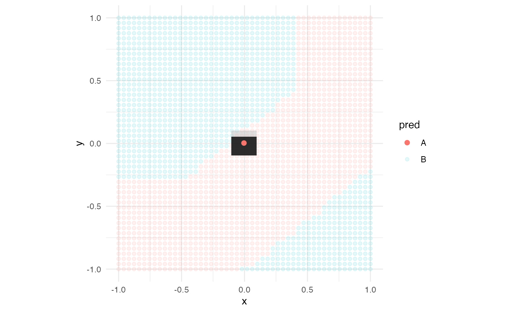
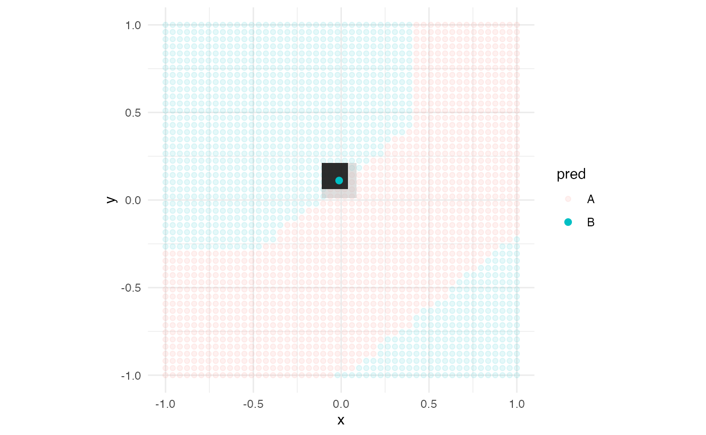
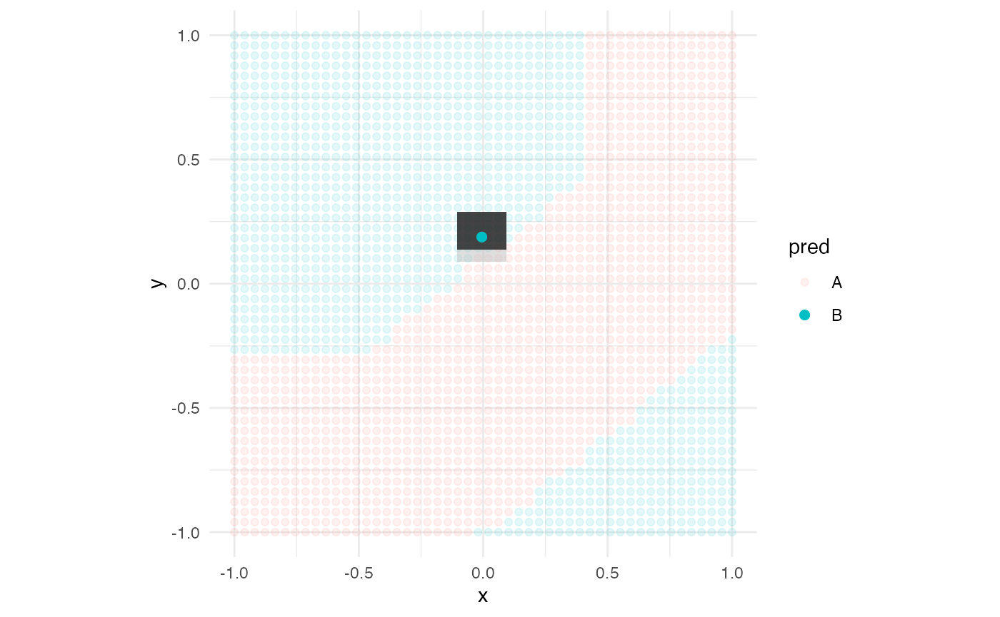
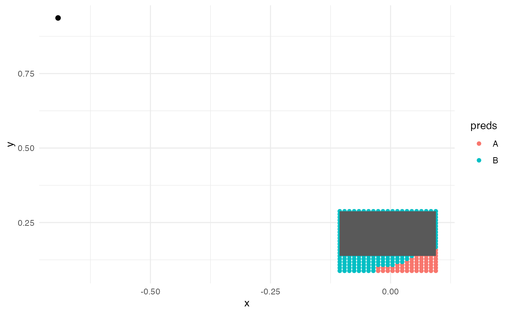

# Two dimensional visualization of kultarr

[`library`](https://rdrr.io/r/base/library.html)`(`[`kultarr`](https://github.com/janithwanni/kultarr)`)`` `[`library`](https://rdrr.io/r/base/library.html)`(`[`randomForest`](https://www.stat.berkeley.edu/~breiman/RandomForests/)`)`` ``#> randomForest 4.7-1.2`` ``#> Type rfNews() to see new features/changes/bug fixes.`` `[`library`](https://rdrr.io/r/base/library.html)`(`[`dplyr`](https://dplyr.tidyverse.org)`)`` ``#> `` ``#> Attaching package: 'dplyr'`` ``#> The following object is masked from 'package:randomForest':`` ``#> `` ``#> combine`` ``#> The following objects are masked from 'package:stats':`` ``#> `` ``#> filter, lag`` ``#> The following objects are masked from 'package:base':`` ``#> `` ``#> intersect, setdiff, setequal, union`` `[`library`](https://rdrr.io/r/base/library.html)`(`[`tidyr`](https://tidyr.tidyverse.org)`)`` `[`library`](https://rdrr.io/r/base/library.html)`(`[`kumquat`](https://janithwanni.github.io/kumquat/)`)`` `[`library`](https://rdrr.io/r/base/library.html)`(`[`ggplot2`](https://ggplot2.tidyverse.org)`)`` ``#> `` ``#> Attaching package: 'ggplot2'`` ``#> The following object is masked from 'package:randomForest':`` ``#> `` ``#> margin`` `` `[`set.seed`](https://rdrr.io/r/base/Random.html)`(``145``)`` `[`data`](https://rdrr.io/r/utils/data.html)`(``"d_multitwo"``)`` ``train_data`` ``<-`` ``d_multitwo`` ``rf_model`` ``<-`` `[`randomForest`](https://rdrr.io/pkg/randomForest/man/randomForest.html)`(``class`` ``~`` ``.``, data ``=`` ``train_data``)`` `` ``model_func`` ``<-`` ``carrier``::`[`crate`](https://rdrr.io/pkg/carrier/man/crate.html)`(``function``(``data``)`` ``{`` `` `[`return`](https://rdrr.io/r/base/function.html)`(``randomForest``:::`[`predict.randomForest`](https://rdrr.io/pkg/randomForest/man/predict.randomForest.html)`(``!``!``rf_model``, ``data``)``)`` ``}``)`` `` ``find_closest`` ``<-`` ``function``(``pt``, ``data``)`` ``{`` `` ``dst`` ``<-`` ``data`` ``|>`` `` `[`mutate`](https://dplyr.tidyverse.org/reference/mutate.html)`(``dst ``=`` `[`sqrt`](https://rdrr.io/r/base/MathFun.html)`(``(``x`` ``-`` ``pt``$``x``)``^``2`` ``+`` ``(``y`` ``-`` ``pt``$``y``)``^``2``)``)`` `` `[`return`](https://rdrr.io/r/base/function.html)`(`[`which.min`](https://rdrr.io/r/base/which.min.html)`(``dst``$``dst``)``)`` ``}`` ``obs`` ``<-`` ``find_closest``(`[`tibble`](https://tibble.tidyverse.org/reference/tibble.html)`(``x ``=`` ``0``, y ``=`` ``0``)``, ``train_data``)`` `` ``final_bounds`` ``<-`` `[`make_anchors`](../reference/make_anchors.md)`(`` `` dataset ``=`` ``train_data``,`` `` cols ``=`` `[`c`](https://rdrr.io/r/base/c.html)`(``"x"``, ``"y"``)``,`` `` instance ``=`` ``train_data``[``obs``, ``]``,`` `` model_func ``=`` ``model_func``,`` `` class_col ``=`` ``"class"``,`` `` verbose ``=`` ``FALSE`` ``)`` ``#> INFO [2026-08-26 23:26:41] setting up bin edges`` ``#> INFO [2026-08-26 23:26:41] setting lower bounds`` ``#> INFO [2026-08-26 23:26:41] Have 2 lower bounds with -0.054531305283308`` ``#> INFO [2026-08-26 23:26:41] Have 2 lower bounds with -0.104531305283308`` ``#> INFO [2026-08-26 23:26:41] setting upper bounds`` ``#> INFO [2026-08-26 23:26:41] Have 2 upper bounds with 0.045468694716692`` ``#> INFO [2026-08-26 23:26:41] Have 2 upper bounds with 0.095468694716692`` ``#> INFO [2026-08-26 23:26:41] setting lower bounds`` ``#> INFO [2026-08-26 23:26:41] Have 2 lower bounds with -0.046591470669955`` ``#> INFO [2026-08-26 23:26:41] Have 2 lower bounds with -0.096591470669955`` ``#> INFO [2026-08-26 23:26:41] setting upper bounds`` ``#> INFO [2026-08-26 23:26:41] Have 2 upper bounds with 0.053408529330045`` ``#> INFO [2026-08-26 23:26:41] Have 2 upper bounds with 0.103408529330045`` ``#> INFO [2026-08-26 23:26:41] received precisions 1 , 0`` ``#> INFO [2026-08-26 23:26:41] found new max_reward -1 and node 1:1:1:1`` ``#> INFO [2026-08-26 23:26:41] max_values`` ``#> INFO [2026-08-26 23:26:41] 2:2:2:2`` ``#> INFO [2026-08-26 23:26:41] received precisions 0.984126984126984 , 0.0158730158730159`` ``#> INFO [2026-08-26 23:26:41] found new max_reward 1.4509776489234 and node 2:1:1:1`` ``#> INFO [2026-08-26 23:26:41] max_values`` ``#> INFO [2026-08-26 23:26:41] 2:2:2:2`` ``#> INFO [2026-08-26 23:26:41] received precisions 1 , 0`` ``#> INFO [2026-08-26 23:26:41] found new max_reward 1.47832713531113 and node 1:2:1:1`` ``#> INFO [2026-08-26 23:26:41] max_values`` ``#> INFO [2026-08-26 23:26:41] 2:2:2:2`` ``#> INFO [2026-08-26 23:26:41] received precisions 1 , 0`` ``#> INFO [2026-08-26 23:26:41] max_values`` ``#> INFO [2026-08-26 23:26:41] 2:2:2:2`` ``#> INFO [2026-08-26 23:26:41] received precisions 0.968253968253968 , 0.0317460317460317`` ``#> INFO [2026-08-26 23:26:41] max_values`` ``#> INFO [2026-08-26 23:26:41] 2:2:2:2`` ``#> INFO [2026-08-26 23:26:41] received precisions 0.988304093567251 , 0.0116959064327485`` ``#> INFO [2026-08-26 23:26:41] found new max_reward 1.50199805708667 and node 2:2:1:1`` ``#> INFO [2026-08-26 23:26:41] max_values`` ``#> INFO [2026-08-26 23:26:41] 2:2:2:2`` ``#> INFO [2026-08-26 23:26:41] received precisions 0.989795918367347 , 0.0102040816326531`` ``#> INFO [2026-08-26 23:26:41] found new max_reward 1.53494710654256 and node 2:1:2:1`` ``#> INFO [2026-08-26 23:26:41] max_values`` ``#> INFO [2026-08-26 23:26:41] 2:2:2:2`` ``#> INFO [2026-08-26 23:26:41] received precisions 0.86734693877551 , 0.13265306122449`` ``#> INFO [2026-08-26 23:26:41] max_values`` ``#> INFO [2026-08-26 23:26:41] 2:2:2:2`` ``#> INFO [2026-08-26 23:26:41] received precisions 1 , 0`` ``#> INFO [2026-08-26 23:26:41] found new max_reward 1.56529729695833 and node 1:2:2:1`` ``#> INFO [2026-08-26 23:26:41] max_values`` ``#> INFO [2026-08-26 23:26:41] 2:2:2:2`` ``#> INFO [2026-08-26 23:26:41] received precisions 0.979591836734694 , 0.0204081632653061`` ``#> INFO [2026-08-26 23:26:41] max_values`` ``#> INFO [2026-08-26 23:26:41] 2:2:2:2`` ``#> INFO [2026-08-26 23:26:41] received precisions 0.976608187134503 , 0.0233918128654971`` ``#> INFO [2026-08-26 23:26:41] max_values`` ``#> INFO [2026-08-26 23:26:41] 2:2:2:2`` ``#> INFO [2026-08-26 23:26:41] received precisions 0.992481203007519 , 0.0075187969924812`` ``#> INFO [2026-08-26 23:26:41] found new max_reward 1.58136313645174 and node 2:2:2:1`` ``#> INFO [2026-08-26 23:26:41] max_values`` ``#> INFO [2026-08-26 23:26:41] 2:2:2:2`` ``#> INFO [2026-08-26 23:26:41] received precisions 0.902255639097744 , 0.0977443609022556`` ``#> INFO [2026-08-26 23:26:41] max_values`` ``#> INFO [2026-08-26 23:26:41] 2:2:2:2`` ``#> INFO [2026-08-26 23:26:41] received precisions 0.902255639097744 , 0.0977443609022556`` ``#> INFO [2026-08-26 23:26:41] max_values`` ``#> INFO [2026-08-26 23:26:41] 2:2:2:2`` ``#> INFO [2026-08-26 23:26:41] received precisions 0.984962406015038 , 0.0150375939849624`` ``#> INFO [2026-08-26 23:26:41] max_values`` ``#> INFO [2026-08-26 23:26:41] 2:2:2:2`` ``#> INFO [2026-08-26 23:26:42] received precisions 0.92797783933518 , 0.07202216066482`` ``#> INFO [2026-08-26 23:26:42] max_values`` ``#> INFO [2026-08-26 23:26:42] 2:2:2:2`

The returned object has several parts in it. For visualisation we would
primarily need the final_anchor and the perturbations used in it.

kultarr has a convenience function called `rule_rect_layers`, which when
given a tibble containing the bounds of either the anchors or the
perturbations, will create a `geom_rect` object that can be used in
ggplot visualisations.

This one is on the lower end

`model_fit`` ``<-`` `[`expand_grid`](https://tidyr.tidyverse.org/reference/expand_grid.html)`(``x ``=`` `[`seq`](https://rdrr.io/r/base/seq.html)`(``-``1``, ``1``, length.out ``=`` ``50``)``, y ``=`` `[`seq`](https://rdrr.io/r/base/seq.html)`(``-``1``, ``1``, length.out ``=`` ``50``)``)`` ``model_fit``$``pred`` ``<-`` ``model_func``(``model_fit``)`` `` `[`ggplot`](https://ggplot2.tidyverse.org/reference/ggplot.html)`(``)`` ``+`` `` `[`geom_point`](https://ggplot2.tidyverse.org/reference/geom_point.html)`(``data ``=`` ``model_fit``, mapping ``=`` `[`aes`](https://ggplot2.tidyverse.org/reference/aes.html)`(``x ``=`` ``x``, y ``=`` ``y``, colour ``=`` ``pred``)``, alpha ``=`` ``0.1``)`` ``+`` `` `[`rule_rect_layers`](../reference/rule_rect_layers.md)`(``final_bounds``$``perturb_bounds``, fill ``=`` ``"gray"``, alpha ``=`` ``0.5``)`` ``+`` `` `[`rule_rect_layers`](../reference/rule_rect_layers.md)`(``final_bounds``$``final_anchor``, fill ``=`` ``"black"``, alpha ``=`` ``0.8``)`` ``+`` `` `[`geom_point`](https://ggplot2.tidyverse.org/reference/geom_point.html)`(``data ``=`` ``train_data``[``obs``, ``]``, mapping ``=`` `[`aes`](https://ggplot2.tidyverse.org/reference/aes.html)`(``x ``=`` ``x``, y ``=`` ``y``, colour ``=`` ``class``)``, size ``=`` ``2``, shape ``=`` ``19``, fill ``=`` ``"black"``)`` ``+`` `` `[`theme_minimal`](https://ggplot2.tidyverse.org/reference/ggtheme.html)`(``)`` ``+`` `` `[`coord_equal`](https://ggplot2.tidyverse.org/reference/coord_fixed.html)`(``)`

`obs`` ``<-`` ``find_closest``(`[`tibble`](https://tibble.tidyverse.org/reference/tibble.html)`(``x ``=`` ``0``, y ``=`` ``0.1``)``, ``train_data``)`` `` ``final_bounds`` ``<-`` `[`make_anchors`](../reference/make_anchors.md)`(`` `` dataset ``=`` ``train_data``,`` `` cols ``=`` `[`c`](https://rdrr.io/r/base/c.html)`(``"x"``, ``"y"``)``,`` `` instance ``=`` ``train_data``[``obs``, ``]``,`` `` model_func ``=`` ``model_func``,`` `` class_col ``=`` ``"class"``,`` `` verbose ``=`` ``FALSE`` ``)`` ``#> INFO [2026-08-26 23:26:42] setting up bin edges`` ``#> INFO [2026-08-26 23:26:42] setting lower bounds`` ``#> INFO [2026-08-26 23:26:42] Have 2 lower bounds with -0.0616270487196744`` ``#> INFO [2026-08-26 23:26:42] Have 2 lower bounds with -0.111627048719674`` ``#> INFO [2026-08-26 23:26:42] setting upper bounds`` ``#> INFO [2026-08-26 23:26:42] Have 2 upper bounds with 0.0383729512803256`` ``#> INFO [2026-08-26 23:26:42] Have 2 upper bounds with 0.0883729512803257`` ``#> INFO [2026-08-26 23:26:42] setting lower bounds`` ``#> INFO [2026-08-26 23:26:42] Have 2 lower bounds with 0.061310753505677`` ``#> INFO [2026-08-26 23:26:42] Have 2 lower bounds with 0.011310753505677`` ``#> INFO [2026-08-26 23:26:42] setting upper bounds`` ``#> INFO [2026-08-26 23:26:42] Have 2 upper bounds with 0.161310753505677`` ``#> INFO [2026-08-26 23:26:42] Have 2 upper bounds with 0.211310753505677`` ``#> INFO [2026-08-26 23:26:42] received precisions 0.395061728395062 , 0.604938271604938`` ``#> INFO [2026-08-26 23:26:42] found new max_reward -1 and node 1:1:1:1`` ``#> INFO [2026-08-26 23:26:42] max_values`` ``#> INFO [2026-08-26 23:26:42] 2:2:2:2`` ``#> INFO [2026-08-26 23:26:42] received precisions 0.253968253968254 , 0.746031746031746`` ``#> INFO [2026-08-26 23:26:42] found new max_reward 0.971125141612951 and node 2:1:1:1`` ``#> INFO [2026-08-26 23:26:42] max_values`` ``#> INFO [2026-08-26 23:26:42] 2:2:2:2`` ``#> INFO [2026-08-26 23:26:42] received precisions 0.579365079365079 , 0.420634920634921`` ``#> INFO [2026-08-26 23:26:42] max_values`` ``#> INFO [2026-08-26 23:26:42] 2:2:2:2`` ``#> INFO [2026-08-26 23:26:42] received precisions 0.611111111111111 , 0.388888888888889`` ``#> INFO [2026-08-26 23:26:42] max_values`` ``#> INFO [2026-08-26 23:26:42] 2:2:2:2`` ``#> INFO [2026-08-26 23:26:42] received precisions 0.253968253968254 , 0.746031746031746`` ``#> INFO [2026-08-26 23:26:42] max_values`` ``#> INFO [2026-08-26 23:26:42] 2:2:2:2`` ``#> INFO [2026-08-26 23:26:42] received precisions 0.426900584795322 , 0.573099415204678`` ``#> INFO [2026-08-26 23:26:42] max_values`` ``#> INFO [2026-08-26 23:26:42] 2:2:2:2`` ``#> INFO [2026-08-26 23:26:42] received precisions 0.459183673469388 , 0.540816326530612`` ``#> INFO [2026-08-26 23:26:42] max_values`` ``#> INFO [2026-08-26 23:26:42] 2:2:2:2`` ``#> INFO [2026-08-26 23:26:42] received precisions 0.163265306122449 , 0.836734693877551`` ``#> INFO [2026-08-26 23:26:42] found new max_reward 1.16088389827451 and node 2:1:1:2`` ``#> INFO [2026-08-26 23:26:42] max_values`` ``#> INFO [2026-08-26 23:26:42] 2:2:2:2`` ``#> INFO [2026-08-26 23:26:43] received precisions 0.729591836734694 , 0.270408163265306`` ``#> INFO [2026-08-26 23:26:43] max_values`` ``#> INFO [2026-08-26 23:26:43] 2:2:2:2`` ``#> INFO [2026-08-26 23:26:43] received precisions 0.387755102040816 , 0.612244897959184`` ``#> INFO [2026-08-26 23:26:43] max_values`` ``#> INFO [2026-08-26 23:26:43] 2:2:2:2`` ``#> INFO [2026-08-26 23:26:43] received precisions 0.450292397660819 , 0.549707602339181`` ``#> INFO [2026-08-26 23:26:43] max_values`` ``#> INFO [2026-08-26 23:26:43] 2:2:2:2`` ``#> INFO [2026-08-26 23:26:43] received precisions 0.586466165413534 , 0.413533834586466`` ``#> INFO [2026-08-26 23:26:43] max_values`` ``#> INFO [2026-08-26 23:26:43] 2:2:2:2`` ``#> INFO [2026-08-26 23:26:43] received precisions 0.285714285714286 , 0.714285714285714`` ``#> INFO [2026-08-26 23:26:43] max_values`` ``#> INFO [2026-08-26 23:26:43] 2:2:2:2`` ``#> INFO [2026-08-26 23:26:43] received precisions 0.342105263157895 , 0.657894736842105`` ``#> INFO [2026-08-26 23:26:43] max_values`` ``#> INFO [2026-08-26 23:26:43] 2:2:2:2`` ``#> INFO [2026-08-26 23:26:43] received precisions 0.548872180451128 , 0.451127819548872`` ``#> INFO [2026-08-26 23:26:43] max_values`` ``#> INFO [2026-08-26 23:26:43] 2:2:2:2`` ``#> INFO [2026-08-26 23:26:43] received precisions 0.440443213296399 , 0.559556786703601`` ``#> INFO [2026-08-26 23:26:43] max_values`` ``#> INFO [2026-08-26 23:26:43] 2:2:2:2`

This one is right on the boundary

[`ggplot`](https://ggplot2.tidyverse.org/reference/ggplot.html)`(``)`` ``+`` `` `[`geom_point`](https://ggplot2.tidyverse.org/reference/geom_point.html)`(``data ``=`` ``model_fit``, mapping ``=`` `[`aes`](https://ggplot2.tidyverse.org/reference/aes.html)`(``x ``=`` ``x``, y ``=`` ``y``, colour ``=`` ``pred``)``, alpha ``=`` ``0.1``)`` ``+`` `` `[`rule_rect_layers`](../reference/rule_rect_layers.md)`(``final_bounds``$``perturb_bounds``, fill ``=`` ``"gray"``, alpha ``=`` ``0.5``)`` ``+`` `` `[`rule_rect_layers`](../reference/rule_rect_layers.md)`(``final_bounds``$``final_anchor``, fill ``=`` ``"black"``, alpha ``=`` ``0.8``)`` ``+`` `` `[`geom_point`](https://ggplot2.tidyverse.org/reference/geom_point.html)`(``data ``=`` ``train_data``[``obs``, ``]``, mapping ``=`` `[`aes`](https://ggplot2.tidyverse.org/reference/aes.html)`(``x ``=`` ``x``, y ``=`` ``y``, colour ``=`` ``class``)``, size ``=`` ``2``, shape ``=`` ``19``, fill ``=`` ``"black"``)`` ``+`` `` `[`theme_minimal`](https://ggplot2.tidyverse.org/reference/ggtheme.html)`(``)`` ``+`` `` `[`coord_equal`](https://ggplot2.tidyverse.org/reference/coord_fixed.html)`(``)`

`obs`` ``<-`` ``find_closest``(`[`tibble`](https://tibble.tidyverse.org/reference/tibble.html)`(``x ``=`` ``0``, y ``=`` ``0.2``)``, ``train_data``)`` `` ``final_bounds`` ``<-`` `[`make_anchors`](../reference/make_anchors.md)`(`` `` dataset ``=`` ``train_data``,`` `` cols ``=`` `[`c`](https://rdrr.io/r/base/c.html)`(``"x"``, ``"y"``)``,`` `` instance ``=`` ``train_data``[``obs``, ``]``,`` `` model_func ``=`` ``model_func``,`` `` class_col ``=`` ``"class"``,`` `` verbose ``=`` ``FALSE`` ``)`` ``#> INFO [2026-08-26 23:26:43] setting up bin edges`` ``#> INFO [2026-08-26 23:26:43] setting lower bounds`` ``#> INFO [2026-08-26 23:26:43] Have 2 lower bounds with -0.0558166175149381`` ``#> INFO [2026-08-26 23:26:43] Have 2 lower bounds with -0.105816617514938`` ``#> INFO [2026-08-26 23:26:43] setting upper bounds`` ``#> INFO [2026-08-26 23:26:43] Have 2 upper bounds with 0.0441833824850619`` ``#> INFO [2026-08-26 23:26:43] Have 2 upper bounds with 0.0941833824850619`` ``#> INFO [2026-08-26 23:26:43] setting lower bounds`` ``#> INFO [2026-08-26 23:26:43] Have 2 lower bounds with 0.137909724656492`` ``#> INFO [2026-08-26 23:26:43] Have 2 lower bounds with 0.0879097246564925`` ``#> INFO [2026-08-26 23:26:43] setting upper bounds`` ``#> INFO [2026-08-26 23:26:43] Have 2 upper bounds with 0.237909724656492`` ``#> INFO [2026-08-26 23:26:43] Have 2 upper bounds with 0.287909724656492`` ``#> INFO [2026-08-26 23:26:43] received precisions 0 , 1`` ``#> INFO [2026-08-26 23:26:43] found new max_reward -1 and node 1:1:1:1`` ``#> INFO [2026-08-26 23:26:43] max_values`` ``#> INFO [2026-08-26 23:26:43] 2:2:2:2`` ``#> INFO [2026-08-26 23:26:43] received precisions 0 , 1`` ``#> INFO [2026-08-26 23:26:43] found new max_reward 1.4509776489234 and node 2:1:1:1`` ``#> INFO [2026-08-26 23:26:43] max_values`` ``#> INFO [2026-08-26 23:26:43] 2:2:2:2`` ``#> INFO [2026-08-26 23:26:43] received precisions 0.0634920634920635 , 0.936507936507937`` ``#> INFO [2026-08-26 23:26:43] max_values`` ``#> INFO [2026-08-26 23:26:43] 2:2:2:2`` ``#> INFO [2026-08-26 23:26:43] received precisions 0.0873015873015873 , 0.912698412698413`` ``#> INFO [2026-08-26 23:26:43] max_values`` ``#> INFO [2026-08-26 23:26:43] 2:2:2:2`` ``#> INFO [2026-08-26 23:26:43] received precisions 0 , 1`` ``#> INFO [2026-08-26 23:26:43] max_values`` ``#> INFO [2026-08-26 23:26:43] 2:2:2:2`` ``#> INFO [2026-08-26 23:26:43] received precisions 0.0467836257309941 , 0.953216374269006`` ``#> INFO [2026-08-26 23:26:43] max_values`` ``#> INFO [2026-08-26 23:26:43] 2:2:2:2`` ``#> INFO [2026-08-26 23:26:43] received precisions 0.0561224489795918 , 0.943877551020408`` ``#> INFO [2026-08-26 23:26:43] max_values`` ``#> INFO [2026-08-26 23:26:43] 2:2:2:2`` ``#> INFO [2026-08-26 23:26:43] received precisions 0 , 1`` ``#> INFO [2026-08-26 23:26:43] found new max_reward 1.50199805708667 and node 2:1:1:2`` ``#> INFO [2026-08-26 23:26:43] max_values`` ``#> INFO [2026-08-26 23:26:43] 2:2:2:2`` ``#> INFO [2026-08-26 23:26:44] received precisions 0.219387755102041 , 0.780612244897959`` ``#> INFO [2026-08-26 23:26:44] max_values`` ``#> INFO [2026-08-26 23:26:44] 2:2:2:2`` ``#> INFO [2026-08-26 23:26:44] received precisions 0.0408163265306122 , 0.959183673469388`` ``#> INFO [2026-08-26 23:26:44] max_values`` ``#> INFO [2026-08-26 23:26:44] 2:2:2:2`` ``#> INFO [2026-08-26 23:26:44] received precisions 0.064327485380117 , 0.935672514619883`` ``#> INFO [2026-08-26 23:26:44] max_values`` ``#> INFO [2026-08-26 23:26:44] 2:2:2:2`` ``#> INFO [2026-08-26 23:26:44] received precisions 0.161654135338346 , 0.838345864661654`` ``#> INFO [2026-08-26 23:26:44] max_values`` ``#> INFO [2026-08-26 23:26:44] 2:2:2:2`` ``#> INFO [2026-08-26 23:26:44] received precisions 0.0300751879699248 , 0.969924812030075`` ``#> INFO [2026-08-26 23:26:44] found new max_reward 1.58136313645174 and node 2:2:1:2`` ``#> INFO [2026-08-26 23:26:44] max_values`` ``#> INFO [2026-08-26 23:26:44] 2:2:2:2`` ``#> INFO [2026-08-26 23:26:44] received precisions 0.0413533834586466 , 0.958646616541353`` ``#> INFO [2026-08-26 23:26:44] max_values`` ``#> INFO [2026-08-26 23:26:44] 2:2:2:2`` ``#> INFO [2026-08-26 23:26:44] received precisions 0.161654135338346 , 0.838345864661654`` ``#> INFO [2026-08-26 23:26:44] max_values`` ``#> INFO [2026-08-26 23:26:44] 2:2:2:2`` ``#> INFO [2026-08-26 23:26:44] received precisions 0.119113573407202 , 0.880886426592798`` ``#> INFO [2026-08-26 23:26:44] max_values`` ``#> INFO [2026-08-26 23:26:44] 2:2:2:2`

[`ggplot`](https://ggplot2.tidyverse.org/reference/ggplot.html)`(``)`` ``+`` `` `[`geom_point`](https://ggplot2.tidyverse.org/reference/geom_point.html)`(``data ``=`` ``model_fit``, mapping ``=`` `[`aes`](https://ggplot2.tidyverse.org/reference/aes.html)`(``x ``=`` ``x``, y ``=`` ``y``, colour ``=`` ``pred``)``, alpha ``=`` ``0.1``)`` ``+`` `` `[`rule_rect_layers`](../reference/rule_rect_layers.md)`(``final_bounds``$``perturb_bounds``, fill ``=`` ``"gray"``, alpha ``=`` ``0.5``)`` ``+`` `` `[`rule_rect_layers`](../reference/rule_rect_layers.md)`(``final_bounds``$``final_anchor``, fill ``=`` ``"black"``, alpha ``=`` ``0.7``)`` ``+`` `` `[`geom_point`](https://ggplot2.tidyverse.org/reference/geom_point.html)`(``data ``=`` ``train_data``[``obs``, ``]``, mapping ``=`` `[`aes`](https://ggplot2.tidyverse.org/reference/aes.html)`(``x ``=`` ``x``, y ``=`` ``y``, colour ``=`` ``class``)``, size ``=`` ``2``, shape ``=`` ``19``, fill ``=`` ``"black"``)`` ``+`` `` `[`theme_minimal`](https://ggplot2.tidyverse.org/reference/ggtheme.html)`(``)`` ``+`` `` `[`coord_equal`](https://ggplot2.tidyverse.org/reference/coord_fixed.html)`(``)`

Try six more different places, some from the axis parallel places etc.

[`ggplot`](https://ggplot2.tidyverse.org/reference/ggplot.html)`(``)`` ``+`` `` `[`geom_point`](https://ggplot2.tidyverse.org/reference/geom_point.html)`(``data ``=`` ``final_bounds``$``perturbs``, mapping ``=`` `[`aes`](https://ggplot2.tidyverse.org/reference/aes.html)`(``x ``=`` ``x``, y ``=`` ``y``, color ``=`` ``preds``)``)`` ``+`` `` `[`rule_rect_layers`](../reference/rule_rect_layers.md)`(``final_bounds``$``final_anchor``)`` ``+`` `` `[`geom_point`](https://ggplot2.tidyverse.org/reference/geom_point.html)`(``data ``=`` ``train_data``[``21``, ``]``, mapping ``=`` `[`aes`](https://ggplot2.tidyverse.org/reference/aes.html)`(``x ``=`` ``x``, y ``=`` ``y``)``, size ``=`` ``2``, shape ``=`` ``19``, fill ``=`` ``"black"``)`` ``+`` `` `[`theme_minimal`](https://ggplot2.tidyverse.org/reference/ggtheme.html)`(``)`

