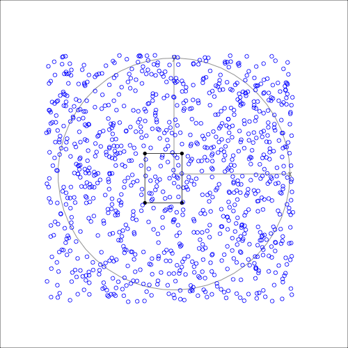

# kultarr 

The goal of `kultarr` is to generate and understand how anchors are
generated in a simpler intuitive approach.

## Installation

You can install the development version of kultarr like so:

`pak``::`[`pak`](https://pak.r-lib.org/reference/pak.html)`(``"janithwanni/kultarr"``)`

## Example

This is a basic example which shows you how to solve a common problem:

[`library`](https://rdrr.io/r/base/library.html)`(`[`kultarr`](https://github.com/janithwanni/kultarr)`)`` ``## basic example code`` `` `[`library`](https://rdrr.io/r/base/library.html)`(`[`randomForest`](https://www.stat.berkeley.edu/~breiman/RandomForests/)`)`` ``#> randomForest 4.7-1.2`` ``#> Type rfNews() to see new features/changes/bug fixes.`` `[`library`](https://rdrr.io/r/base/library.html)`(`[`dplyr`](https://dplyr.tidyverse.org)`)`` ``#> `` ``#> Attaching package: 'dplyr'`` ``#> The following object is masked from 'package:randomForest':`` ``#> `` ``#> combine`` ``#> The following objects are masked from 'package:stats':`` ``#> `` ``#> filter, lag`` ``#> The following objects are masked from 'package:base':`` ``#> `` ``#> intersect, setdiff, setequal, union`` `[`library`](https://rdrr.io/r/base/library.html)`(`[`tidyr`](https://tidyr.tidyverse.org)`)`` `` `[`set.seed`](https://rdrr.io/r/base/Random.html)`(``145``)`` ``train_data`` ``<-`` `[`data.frame`](https://rdrr.io/r/base/data.frame.html)`(``x ``=`` `[`runif`](https://rdrr.io/r/stats/Uniform.html)`(``100``)``, y ``=`` `[`runif`](https://rdrr.io/r/stats/Uniform.html)`(``100``)``, z ``=`` `[`runif`](https://rdrr.io/r/stats/Uniform.html)`(``100``)``)`` ``train_data``[``21``, ``]`` ``<-`` `[`c`](https://rdrr.io/r/base/c.html)`(``0.5``, ``0.5``, ``0.5``)`` ``train_data``$``cls`` ``<-`` `[`factor`](https://rdrr.io/r/base/factor.html)`(`[`ifelse`](https://rdrr.io/r/base/ifelse.html)`(``train_data``$``x`` ``>`` ``0.5`` ``&`` ``train_data``$``y`` ``>`` ``0.5``, ``"U"``, ``"D"``)``)`` `` ``rf_model`` ``<-`` `[`randomForest`](https://rdrr.io/pkg/randomForest/man/randomForest.html)`(``cls`` ``~`` ``.``, data ``=`` ``train_data``)`` `` ``model_func`` ``<-`` ``carrier``::`[`crate`](https://rdrr.io/pkg/carrier/man/crate.html)`(``function``(``data``)`` ``{`` `` `[`return`](https://rdrr.io/r/base/function.html)`(``randomForest``:::`[`predict.randomForest`](https://rdrr.io/pkg/randomForest/man/predict.randomForest.html)`(``!``!``rf_model``, ``data``)``)`` ``}``)`` `` ``final_bounds`` ``<-`` `[`make_anchors`](reference/make_anchors.md)`(`` `` dataset ``=`` ``train_data``,`` `` cols ``=`` `[`c`](https://rdrr.io/r/base/c.html)`(``"x"``, ``"y"``, ``"z"``)``,`` `` instance ``=`` ``train_data``[``21``, ``]``,`` `` model_func ``=`` ``model_func``,`` `` class_col ``=`` ``"cls"``,`` `` verbose ``=`` ``FALSE`` ``)`

The `final_bounds` variable is a list containing both the history of the
algorithm (`reward_history`) and the resulting anchor (`final_anchor`).

[`str`](https://rdrr.io/r/utils/str.html)`(``final_bounds``)`` ``#> List of 4`` ``#> $ final_anchor : tibble [2 × 8] (S3: tbl_df/tbl/data.frame)`` ``#> ..$ id : int [1:2] 1 1`` ``#> ..$ x : num [1:2] 0.4 0.55`` ``#> ..$ y : num [1:2] 0.4 0.6`` ``#> ..$ z : num [1:2] 0.4 0.6`` ``#> ..$ bound : chr [1:2] "lower" "upper"`` ``#> ..$ reward: num [1:2] 1.48 1.48`` ``#> ..$ prec : num [1:2] 0.901 0.901`` ``#> ..$ cover : num [1:2] 0.546 0.546`` ``#> $ reward_history:'data.frame': 64 obs. of 5 variables:`` ``#> ..$ node_tag: chr [1:64] "1:1:1:1:1:1" "2:1:1:1:1:1" "1:2:1:1:1:1" "1:1:2:1:1:1" ...`` ``#> ..$ reward : num [1:64] 1.21 1.29 1.06 1.29 1.15 ...`` ``#> ..$ prec : num [1:64] 0.852 0.905 0.706 0.905 0.793 ...`` ``#> ..$ cover : num [1:64] 0.0787 0.1224 0.1224 0.1224 0.1224 ...`` ``#> ..$ id : int [1:64] 1 1 1 1 1 1 1 1 1 1 ...`` ``#> $ perturbs : tibble [9,261 × 5] (S3: tbl_df/tbl/data.frame)`` ``#> ..$ x : num [1:9261] 0.4 0.4 0.4 0.4 0.4 0.4 0.4 0.4 0.4 0.4 ...`` ``#> ..$ y : num [1:9261] 0.4 0.4 0.4 0.4 0.4 0.4 0.4 0.4 0.4 0.4 ...`` ``#> ..$ z : num [1:9261] 0.4 0.41 0.42 0.43 0.44 0.45 0.46 0.47 0.48 0.49 ...`` ``#> ..$ id : int [1:9261] 1 1 1 1 1 1 1 1 1 1 ...`` ``#> ..$ preds: Factor w/ 2 levels "D","U": 1 1 1 1 1 1 1 1 1 1 ...`` ``#> .. ..- attr(*, "names")= chr [1:9261] "1" "2" "3" "4" ...`` ``#> $ perturb_bounds: tibble [2 × 5] (S3: tbl_df/tbl/data.frame)`` ``#> ..$ id : int [1:2] 1 1`` ``#> ..$ x : num [1:2] 0.4 0.6`` ``#> ..$ y : num [1:2] 0.4 0.6`` ``#> ..$ z : num [1:2] 0.4 0.6`` ``#> ..$ bound: chr [1:2] "lower" "upper"`

The resulting anchor will have the reward, the precision and the
coverage of the underlying algorithm as additional diagnostic
information.

`final_bounds``$``final_anchor`` ``#> # A tibble: 2 × 8`` ``#> id x y z bound reward prec cover`` ``#> <int> <dbl> <dbl> <dbl> <chr> <dbl> <dbl> <dbl>`` ``#> 1 1 0.4 0.4 0.4 lower 1.48 0.901 0.546`` ``#> 2 1 0.55 0.6 0.6 upper 1.48 0.901 0.546`

The diagnostic information can be helpful in understanding where the
algorithm explored in the solution space.

# Visualizing anchors in high dimensions

If the anchor has a dimension larger than 3 then it is possible to
visualize it in high dimensions using tours.

There are several S7 classes built to make the process of visualizing
the bounding box(es). (The option to visualize multiple boxes is still
under development)

#### 1. Create a bounding_box object by giving the result from the underlying algorithm

`bnd_box`` ``<-`` `[`bounding_box`](reference/bounding_box.md)`(`` `` bounds_tbl ``=`` ``final_bounds``$``final_anchor``,`` `` target_inst_row ``=`` ``train_data``[``1``, ``]`` ``|>`` `[`select`](https://dplyr.tidyverse.org/reference/select.html)`(``x``, ``y``, ``z``)``,`` `` point_colors ``=`` ``"black"``,`` `` edges_colors ``=`` ``"black"`` ``)`

#### 2. Create an anchor_tour object to hold the data needed to create the animation

`anc_tour`` ``<-`` `[`anchor_tour`](reference/anchor_tour.md)`(`` `` ``bnd_box``,`` `` ``train_data`` ``|>`` `[`select`](https://dplyr.tidyverse.org/reference/select.html)`(``x``, ``y``, ``z``)``,`` `` ``"blue"`` ``)`

#### 3. Animate using the animate_anchor function by passing the anchor_tour object

[`animate_anchor`](reference/animate_anchor.md)`(`` `` ``anc_tour``,`` `` gif_file ``=`` ``"man/figures/tour_animation.gif"``,`` `` width ``=`` ``500``,`` `` height ``=`` ``500``,`` `` frames ``=`` ``360`` ``)`

